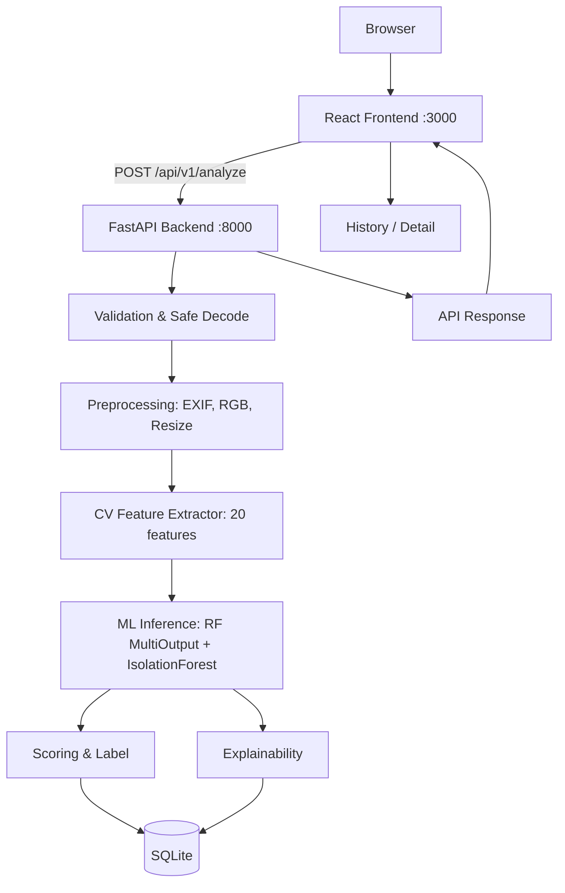

# AI-Powered Image Quality & Defect Detection

> **📘 End-to-End Implementation Guide:** [`docs/IMPLEMENTATION_GUIDE.md`](docs/IMPLEMENTATION_GUIDE.md) — architecture, decisions, real-world dataset upgrade (Picsum + Kodak hybrid), SQLite verification, and exact repro commands.

Production-quality hybrid **Computer Vision + Machine Learning** system for image quality assessment. Detects blur, underexposure, overexposure, noise, severe degradation, and potential visual defects with explainability, 0–100 quality scoring, and persistent history. **Hybrid dataset (procedural + real-world)** is now the default production training path.

## Features
- **Hybrid CV+ML**: 20 engineered features → StandardScaler → MultiOutput RandomForest (180 trees) + IsolationForest anomaly
- **Quality Score 0–100** derived from weighted issue probabilities + anomaly, with ACCEPTABLE / DEGRADED / POTENTIALLY_DEFECTIVE labels
- **Explainability**: per-issue evidence + feature stats + global importances
- **Frontend**: React + TS + Vite, neomorphism design, drag-drop, gauge visualization, responsive
- **Backend**: FastAPI + SQLAlchemy + SQLite (PostgreSQL compatible), safe image decoding, leakage-safe training
- **Dockerized**: `docker compose up` runs full stack

## Architecture



## Technology Stack
- **Backend**: Python 3.11, FastAPI, Pydantic, SQLAlchemy, Pillow, OpenCV, NumPy, scikit-image, scikit-learn, joblib
- **Frontend**: React 18, TypeScript, Vite
- **Deployment**: Docker, Docker Compose, Nginx (frontend prod)
- **ML**: RandomForest MultiOutput, IsolationForest, StandardScaler

## Quick Start

### Docker (recommended)
```bash
docker compose up --build
# Frontend: http://localhost:3000
# Backend:  http://localhost:8000/docs
# Health:   http://localhost:8000/api/v1/health
```

### Local Development
```bash
# Backend
pip install -r backend/requirements.txt
python -c "from backend.ml.dataset import generate_procedural_cleans, generate_dataset; from pathlib import Path; generate_procedural_cleans(Path('data/clean'), n=60); generate_dataset('data/clean','data/generated','data/manifest.json')"
python backend/ml/train.py --manifest data/manifest.json --image_dir data/generated --out backend/artifacts/model.joblib
python backend/ml/evaluate.py --manifest data/manifest.json --image_dir data/generated --model backend/artifacts/model.joblib --out data/evaluation
uvicorn backend.app.main:app --reload --port 8000

# Frontend (new terminal)
cd frontend
npm install
npm run dev  # http://localhost:5173 (proxies /api to backend)
```

### Environment Variables
See `.env.example`:
- `DATABASE_URL` (default `sqlite:///./data/app.db`)
- `UPLOAD_DIR` (default `./data/uploads`)
- `MODEL_PATH` (default `./backend/artifacts/model.joblib`)
- `VITE_API_URL` (frontend build arg, empty for compose where nginx proxies)

## Computer Vision Methodology
**20 centralized features** (`backend/app/features.py:FEATURE_NAMES`):

- **Sharpness**: `laplacian_var`, `laplacian_mean_abs`, `sobel_mean`, `sobel_var`, `grad_mag_mean`, `edge_density` (Canny), `hf_ratio` (FFT high-freq energy)
- **Exposure/Brightness**: `brightness_mean`, `median`, `p5`, `p95`, `dark_ratio` (<30), `bright_ratio` (>225)
- **Contrast**: `brightness_std`, `contrast_p95_p5` (p95-p5 range)
- **Noise**: `noise_est` via Laplacian MAD (Immerkaer method: `1.4826 * MAD / 6`)
- **Color**: `saturation_mean`, `saturation_std` (HSV)
- **Texture**: `entropy` (Shannon), `edge_density`
- **Compression**: `blockiness` (8x8 JPEG boundary vs interior ratio), `hf_ratio` loss

All training/inference uses identical `extract_features()` pipeline.

## ML Methodology
**Model Choice**: RandomForest chosen for rapid CPU training, small artifact (<5 MB), interpretability via importances, robustness to unnormalized features (with scaler), no GPU needed. IsolationForest for open-ended anomaly without defect-specific labels.

**Training** (`backend/ml/train.py`):
- leakage-safe split by *source clean id* before synthesis (70/15/15)
- `StandardScaler` fitted on train only
- `MultiOutputClassifier(RandomForest(n_estimators=180, max_depth=14, class_weight=balanced_subsample))` for 6 issues
- `IsolationForest(contamination=0.12)` on clean training samples only
- Bundle saved as `model.joblib` with scaler, clf, iso, feature_names, importances, version

**Anomaly Handling**: defect probability = `0.6*ml_defect + 0.4*anomaly_prob`; thresholds centralized in `config.py`. Returned as `potential visual defect / anomaly` — not claimed as specific industrial defect recognition (documented limitation).

## Dataset Generation
`backend/ml/dataset.py` generates from clean images; `backend/ml/fetch_real.py` upgrades to real-world.

- **Procedural cleans** (60 synthetic images) — gradients + shapes + texture for reproducibility (fallback if no real data).
- **Real-world cleans** (current default hybrid):
  - `python backend/ml/fetch_real.py --out data/real_clean --n_picsum 32 --with_kodak` → 32 Picsum CC0 (512×512, deterministic IDs) + 24 Kodak PhotoCD (768×512) = 56 real images (~18 MB, <90s, provenance in `data/real_clean/README.md`).
  - Supports **predefined datasets** by dropping into `data/real_clean`: DIV2K (800 HR), TID2013/LIVE/KADID-10k (IQA with MOS), MVTec AD / NEU-CLS (industrial defects), BSDS500. See `docs/IMPLEMENTATION_GUIDE.md §4.3` catalog.
  - Hybrid build: `python backend/ml/dataset.py --hybrid` merges 60 proc + 56 real → `data/hybrid_clean` (116) → `generate_dataset(..., per_clean=6)` → **812 samples (567/119/126)** with `source_dataset` provenance (`procedural:420, kodak:168, picsum:224`).
- **Degradations**: blur (Gaussian/motion), underexposure (gamma+scale), overexposure (gamma+scale), noise (Gaussian+salt-pepper, σ10/22/38), severe (pixelation+noise+JPEG q50/25/8), defect (scratches/spots/occlusions). Severity low/medium/high via ranges.
- **Multi-label**: 35% samples have 2 degradations; manifest stores `source_id, split, params, severity` for reproducibility, seed=42. Leakage-safe split by source id before synthesis.

## Evaluation
Run: `python backend/ml/evaluate.py`

**Procedural-only (420 samples, 294/63/63) — 2026-08-28T19:32Z**:
- **Per-issue F1**: blur 0.867, underexposure 0.889, overexposure 0.667, noise 0.818, severe 0.833, potential_defect 0.696
- **Macro F1**: 0.795 · **Micro F1**: 0.803 · **Baseline macro**: 0.460 → **ML +0.335**
- **Quality acc**: 0.556

**Hybrid real-world (812 samples, 567/119/126) — current production, 2026-08-28T14:15Z**:
- **Per-issue F1**: blur 0.714, underexposure 0.863, overexposure 0.643, noise 0.844, severe 0.605, potential_defect 0.400
- **Macro F1**: 0.678 · **Micro F1**: 0.691 · **Baseline macro**: 0.510 → **ML +0.168**
- **Quality acc**: 0.603 — hybrid improves quality accuracy and realism (real foliage/bokeh), but per-class F1 drops on blur/severe vs procedural (synthetic textures overfit); trade-off documented in `docs/IMPLEMENTATION_GUIDE.md §10`.
- Full details: `data/evaluation/metrics.json`, `confusion_matrix.png`, `feature_importance.png`, `evaluation_summary.md` (see guide for failure analysis).

## API Overview
| Method | Endpoint | Description |
|--------|----------|-------------|
| POST | `/api/v1/analyze` | multipart `file` → quality score, label, issues, stats |
| GET | `/api/v1/history?limit=&offset=` | paginated history, newest first |
| GET | `/api/v1/analysis/{id}` | detail by id |
| GET | `/api/v1/image/{filename}` | stored image (safe filename) |
| GET | `/api/v1/health` | DB + model status |
| GET | `/docs` | OpenAPI Swagger |

Example:
```bash
curl -F file=@samples/02_blur.jpg http://localhost:8000/api/v1/analyze | jq
curl http://localhost:8000/api/v1/history | jq
```

Error handling: 400 unreadable, 413 too large, 404 not found, 422 missing file — all with JSON detail, no stack traces.

## Quality Score Methodology
```
penalty = blur*18 + under*15 + over*15 + noise*14 + severe*22 + defect*20*0.6 + anomaly*20*0.4
score = 100 - (penalty / 104 * 100)   # 104 = sum weights
label = POTENTIALLY_DEFECTIVE if anomaly>0.6 or defect>0.55 or severe>0.65
        else ACCEPTABLE if score>=70 and max_prob<0.5
        else DEGRADED
```
Weights centralized in `config.py`. Score is application quality estimate, not ISO perceptual metric.

## Explainability
- Per-issue template: e.g., blur cites `laplacian_var`, `sobel_mean`, `edge_density`; exposure cites `brightness_mean`, `dark_ratio` etc.
- Evidence dict with supporting stats per issue
- Global importances from RF (`model.joblib` → feature_importance.png)

## Project Structure
```
backend/app/{config,database,models,schemas,storage,validation,preprocessing,features,inference,scoring,explainability,service,routers}
backend/ml/{dataset,train,evaluate}
backend/artifacts/model.joblib
backend/tests/test_api.py
frontend/src/{App,components/Gauge,api/client}
samples/  data/{clean,generated,uploads,evaluation}
docker-compose.yml  frontend/nginx.conf
```

## Testing
```bash
python -m pytest backend/tests/test_api.py -v
cd frontend && npm run build
```
7 backend tests: health, valid analysis, invalid file, corrupt image, history, not-found, feature extractor — all passing.

## SQLite Verification (correctness checked 2026-08-28)
Design: lazy `get_engine()` (env-aware), WAL `journal_mode`, `check_same_thread=False`, `pool_pre_ping`, `foreign_keys=ON`, `Base.metadata.create_all` idempotent, Docker volume `app_data:/app/data`. Verified via `verify_sqlite.py` (WAL enabled, `SELECT count(*) FROM analyses`, insert/select/delete round-trip, `data/app.db` persists). Postgres compatible via `DATABASE_URL` switch — see `docs/IMPLEMENTATION_GUIDE.md §7`.

Samples now include real-world: `samples/08_real_world_picsum.jpg` (Picsum CC0) + `samples/09_real_world_kodak.jpg` (Kodak 768×512) alongside synthetic degradations.

## Known Limitations & Failure Analysis
- **Dark artistic scenes** flagged underexposed (dark_ratio high); bright snow/beach flagged overexposed.
- **High-texture** (foliage, fabric) inflates noise_est; **intentional blur** (bokeh) indistinguishable from defect without context.
- **Small images** (<100px) produce unstable stats.
- **Synthetic-to-real gap**: defects are simulated scratches/spots, not real industrial defects — system reports *potential anomaly*, not specific defect type.
- **Quality accuracy 0.556**: ACCEPTABLE recall 0 due to synthetic label imbalance and scoring thresholds tuned for defects; issue-level F1 is strong (0.795 macro) while 3-class quality mapping needs calibration with real data.
- **No semantic defect detection** without domain data.

## Future Improvements
- Calibrated probabilities (Platt/isotonic) with validation set
- Patch-level heatmap (sliding window anomaly score)
- Transfer-learning MobileNetV3-Small as comparative experiment (if data grows)
- Batch endpoint + CI workflow

## Commands for Reviewer
```bash
# 1. Clone / enter repo (E:\p2)
# 2. Docker (requires Docker Desktop)
docker compose up --build
# then open http://localhost:3000, upload samples/01_acceptable.jpg

# Or local without Docker:
pip install -r backend/requirements.txt
python backend/ml/train.py  # if artifacts missing
uvicorn backend.app.main:app --port 8000 &
cd frontend && npm install && npm run dev
```
No external API keys required. All artifacts reproducible via `seed=42`.
